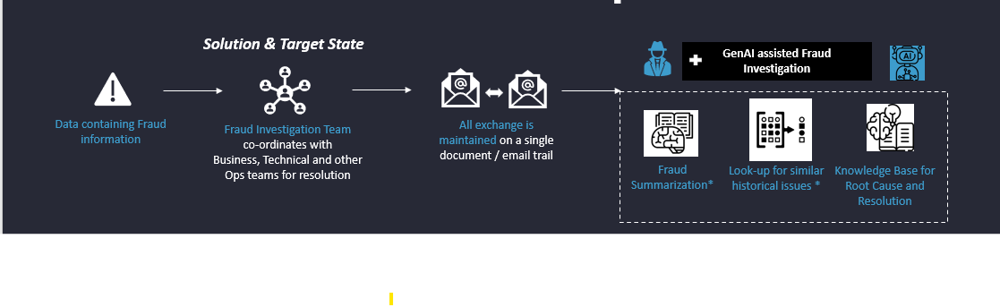
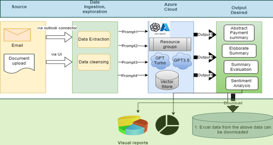
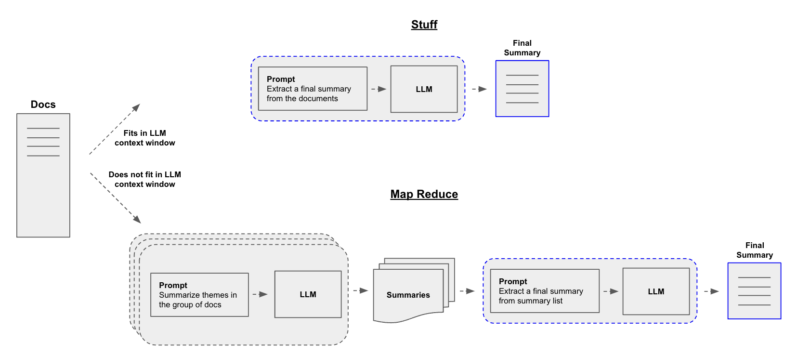

# Detective.ai
An Investigation Bot to augment efficient Fraud Investigation…


### Description
The use case presents a significant challenge in the financial services sector, where the rise of online transactions has led to an increase in fraudulent activities. The current approach relies heavily on manual intervention by Fraud Investigation Teams, who sniff through various documents, emails, and communication channels to identify the root causes and resolutions of fraudulent transactions. This process is not only time-consuming but also prone to human error, leading to inefficiencies and potential lapses in security.

Leveraging detective.ai generative AI to enhance fraud detection systems could revolutionize the way financial institutions handle fraud. By automating the investigation process, AI can automate with increased accuracy, efficiency, and speed of Fraud Investigation process with effective investigation summary with root case and resolutions and building a live knowledge base that will be available to Fraud Squads.

Future fraud investigations can also be expedited to  continuously assess transactions and activities for signs of fraud by mining the corpus for Fraud Investigators to help identification of possible root cause and resolution. Using the live book-keeper as a Fraud Knowledge Base, solution utilizes Generative AI to create synthetic fraud patterns and data, providing valuable training material for machine learning models.

The primary users of this generative AI solution would be Banks, Credit Card Companies, Credit Bureaus, Fraud Analysts, Investigation Agencies, Insurance Companies. These stakeholders have a vested interest in protecting customer assets and data, and they require a system that can quickly and accurately detect and resolve fraudulent activities.

The implementation of generative AI in fraud detection can significantly enhance the security framework of financial institutions. It can lead to a more robust defence against fraud, safeguarding the interests of all parties involved. Moreover, it can establish a proactive approach to fraud prevention, potentially saving millions in lost revenue and maintaining customer trust in the financial system.

## Design

add flow diagram here

add refe sys Design here



## the stack

- Application is completely managed using [Poetry](https://python-poetry.org/docs/) . Poetry is a tool for dependency management and packaging in Python. It allows you to declare the libraries your project depends on and it will manage (install/update) them for you. Poetry offers a lockfile to ensure repeatable installs, and can build your project for distribution.

- Our application is powered with the gpt-3.5-turbo-16k with 16,385 tokens context window.
- Its built using Python with [Langchain](https://python.langchain.com/docs/get_started/introduction/) orchestrator.Langchain, langchain_core, Langchain_openai etc are some of the packages used.
- Application takes list of documents as input. In put emails are in format of .txt documents uploaded to the azure blob storage.  And Azure blob storage loader is used to load the documents for processing.
- We are leveraging  summarization techniques :
		
	- Stuff: Simply “stuff” all your documents into a single prompt.
		
	- Map-reduce: Summarize each document on it’s own in a “map” step and then “reduce” the summaries into a final summary.
	
    

- The user interface for the application is built with Streamlit is an open-source Python framework help you create and  ship frontend apps that can be written in python.
## How to run locally

### project dependancies:

#### install following dependancies and run the app as streamlit application :
- python = ">=3.11,<3.12"
- openai = "^1.24.0"
- python-dotenv = "^1.0.1"
- streamlit = "^1.33.0"
- ipykernel = "^6.29.4"
- langchain-openai = "^0.1.6"
- tiktoken = "^0.6.0"
- chromadb = "^0.5.0"
- langchain = "^0.1.17"
- langchainhub = "^0.1.15"
- azure-storage-blob = "^12.19.1"
- unstructured = "^0.13.6"

#### Create a .env file with all required keys, use following sample format:

```.env
export AZURE_OPENAI_API_KEY="your key"
export AZURE_OPENAI_ENDPOINT="your endpoint"
export OPENAI_API_VERSION="xxxx-x-x-preview"
export STORAGE_ACCOUNT_KEY="your storage account key"
export storage_account_name="stroage account name"
export connection_string="storage account connection string"
```
